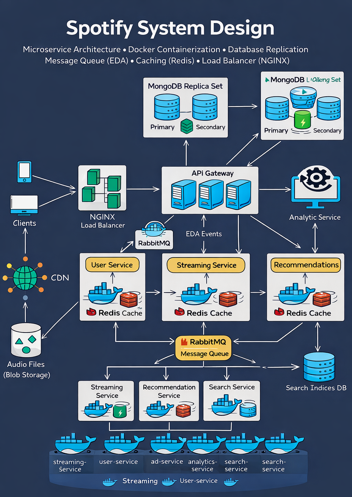
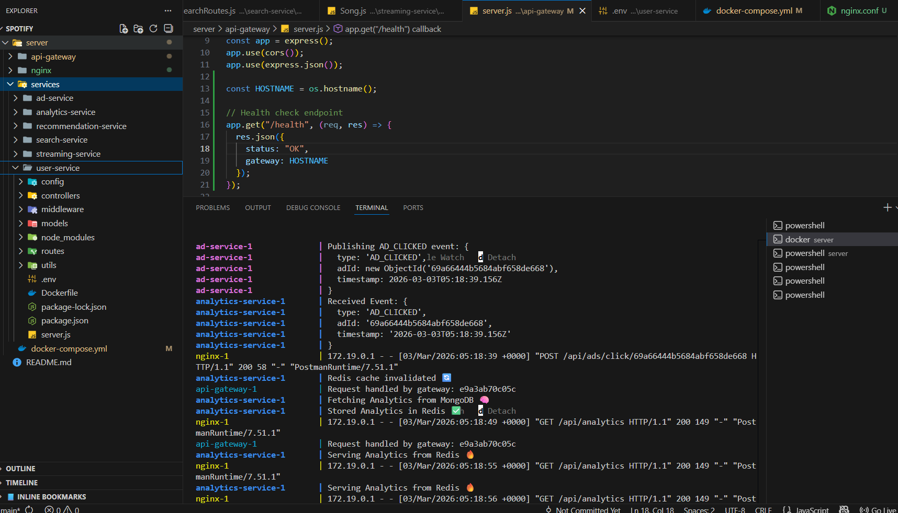
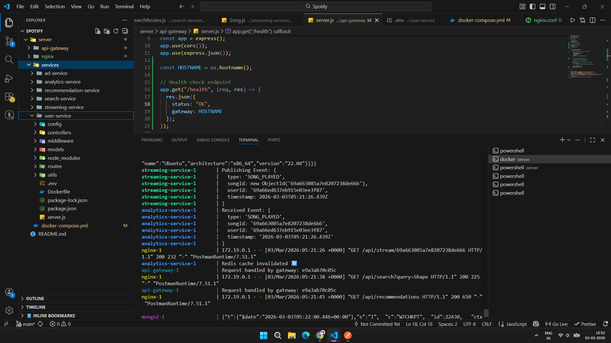
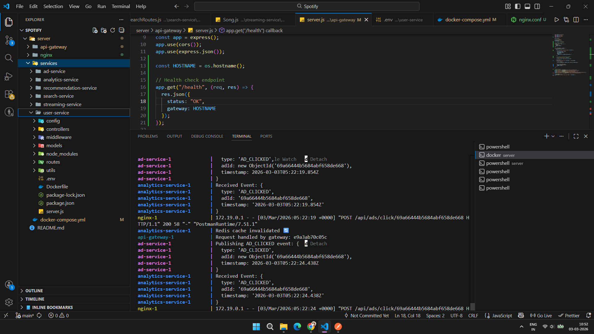

# 🎧 Spotify Backend System Design

A production-style distributed Spotify backend built using **Microservices Architecture**, designed for scalability, fault tolerance, and high availability.

---

## 🏗️ System Architecture Diagram

<p align="center">
  
</p>

---

## 🚀 Architecture Overview

This system simulates a real-world distributed backend similar to Spotify using modern backend engineering principles.

### 🔹 High-Level Request Flow

Client  
⬇  
NGINX Load Balancer  
⬇  
API Gateway (Multiple Instances)  
⬇  
Microservices  
⬇  
MongoDB Replica Set  
⬇  
RabbitMQ (Event-Driven Architecture)  
⬇  
Redis Cache  

---

## 🧱 Tech Stack

| Technology | Purpose |
|------------|----------|
| Node.js | Backend runtime |
| Express.js | Web framework |
| MongoDB | Primary Database |
| MongoDB Replica Set | High availability |
| Redis | Caching layer |
| RabbitMQ | Event-driven communication |
| Docker | Containerization |
| NGINX | Load balancing |
| Axios | Internal service communication |

---

## 🏗️ Microservices

| Service | Responsibility |
|----------|---------------|
| User Service | User registration, login, authentication |
| Streaming Service | Stream songs, update play counts |
| Ad Service | Manage advertisements & click tracking |
| Analytics Service | Aggregate system metrics |
| Search Service | Song search functionality |
| Recommendation Service | Personalized recommendations |
| API Gateway | Central routing layer |

---

## 📁 Project Structure

```
spotify-backend/
│
├── docker-compose.yml
├── README.md
├── assets/
│   └── spotify_design.png
│
├── nginx/
│   └── nginx.conf
│
├── api-gateway/
│   ├── Dockerfile
│   ├── package.json
│   └── server.js
│
├── services/
│   ├── user-service/
│   ├── streaming-service/
│   ├── ad-service/
│   ├── analytics-service/
│   ├── search-service/
│   └── recommendation-service/
│
└── shared/
    └── rabbitmq.js
```

---

## 🐳 Docker Containerization

All services are containerized using Docker.

### Run Entire System

```bash
docker compose up --build --scale api-gateway=3 -d
```

### Stop System

```bash
docker compose down
```

---

## 🗄️ MongoDB Replica Set Setup

After containers start, initialize replica set:

```bash
docker exec -it <mongo1-container-id> mongosh
```

Then run:

```js
rs.initiate({
  _id: "rs0",
  members: [
    { _id: 0, host: "mongo1:27017" },
    { _id: 1, host: "mongo2:27017" },
    { _id: 2, host: "mongo3:27017" }
  ]
})
```

Verify:

```js
rs.status()
```

---

## 📨 RabbitMQ Dashboard

Access management UI:

```
http://localhost:15672
```

Default credentials:
```
Username: guest
Password: guest
```

---

## ⚡ Redis Caching Strategy

- Frequently accessed data cached
- Reduces database load
- Improves response time
- Used for:
  - Song metadata
  - User session caching
  - Trending tracks

---

## ⚖️ Load Balancing Strategy

NGINX distributes incoming traffic across multiple API Gateway instances.

```bash
--scale api-gateway=3
```

Ensures:
- High availability
- Horizontal scalability
- Fault tolerance

---

## 🔄 Event-Driven Architecture

RabbitMQ is used for:

- Song played events
- Ad click tracking
- Analytics aggregation
- Recommendation updates

This decouples services and improves scalability.

---

## 📈 Scalability Features

- Horizontal scaling using Docker
- Replica database for fault tolerance
- Caching layer for high performance
- Event-driven asynchronous processing
- Stateless microservices

---

## 🧠 Engineering Concepts Demonstrated

- Microservices Architecture
- API Gateway Pattern
- Load Balancing
- Database Replication
- Event-Driven Architecture (EDA)
- Caching Strategy
- Distributed System Design
- Container Orchestration

---

## 🎯 Future Improvements

- Kubernetes deployment
- CI/CD pipeline integration
- Circuit breaker pattern
- Rate limiting
- JWT-based authentication middleware
- Prometheus + Grafana monitoring
- Distributed tracing

---

---

# 🖥️ Outputs Screen

## Cashing

<p align="center">
  
</p>

---

## Message Queue(RabbitMQ)

<p align="center">
  
</p>

---

## Load Balancer(nginx) and EDA(Event Driven Architecture)

<p align="center">
  
</p>

---

## 👨‍💻 Author

**K Jeevan Kumar**  
8th Sem CSE  
Passionate Backend Developer  

---

## ⭐ Why This Project?

This project demonstrates real-world backend engineering skills required for:

- Product-based companies
- SDE roles
- Distributed system interviews
- Backend architecture discussions

---

## 📜 License

This project is built for educational and portfolio purposes.
