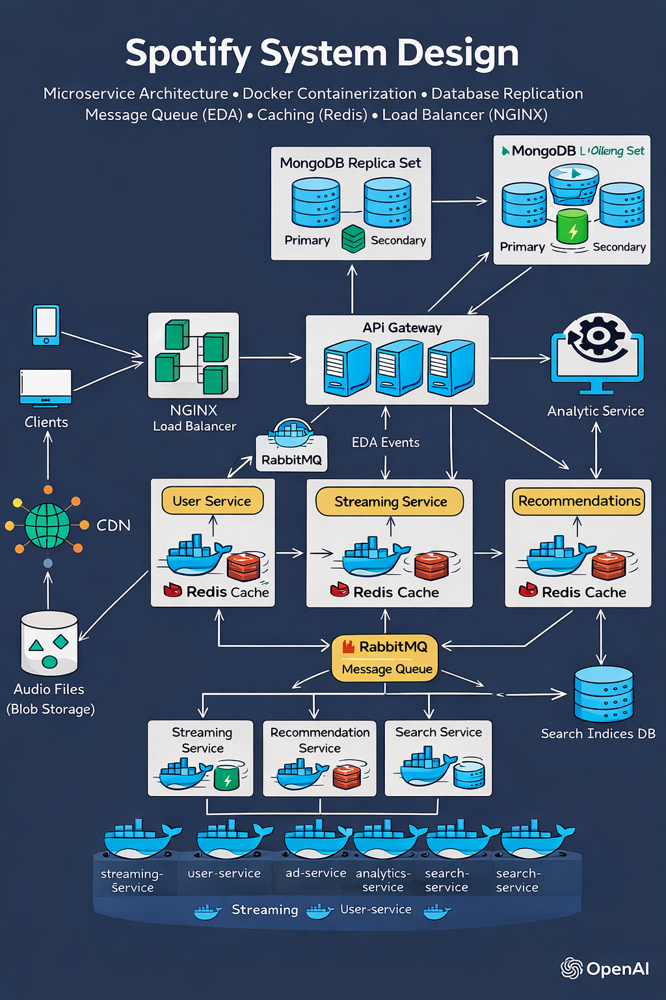

# 🎧 Spotify Backend System Design

A production-style distributed Spotify backend built using **Microservices Architecture**, 
featuring:

## 🏗️ System Architecture Diagram



- 🐳 Docker Containerization
- 🗄️ MongoDB Replica Set (Database Replication)
- 📨 RabbitMQ (Event-Driven Architecture)
- ⚡ Redis Caching
- ⚖️ NGINX Load Balancer
- 🚪 API Gateway Pattern

---

## 🚀 Architecture Overview

This system is designed as a scalable, fault-tolerant distributed backend similar to Spotify.

### 🔹 High-Level Flow

Client  
⬇  
NGINX Load Balancer  
⬇  
API Gateway (Scaled Instances)  
⬇  
Microservices  
⬇  
MongoDB Replica Set  
⬇  
RabbitMQ (EDA)  
⬇  
Redis Cache  

---

## 🏗️ Microservices

| Service | Responsibility |
|----------|---------------|
| User Service | User registration, login, authentication |
| Streaming Service | Stream songs, update play counts |
| Ad Service | Manage advertisements, track clicks |
| Analytics Service | Aggregate system statistics |
| Search Service | Handle song search |
| Recommendation Service | Provide song recommendations |
| API Gateway | Central routing layer |

---

## 🐳 Docker Containerization

All services are containerized using Docker.

### Run Entire System

```bash
docker compose up --build --scale api-gateway=3 -d
